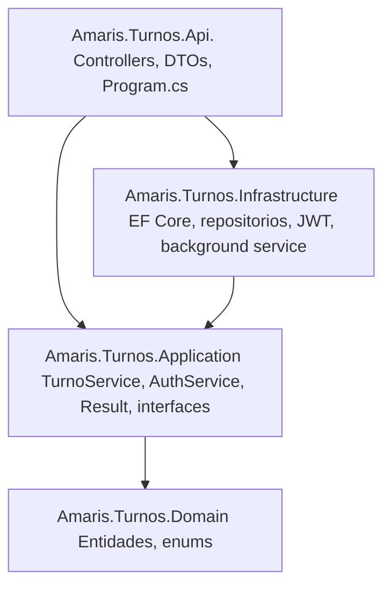
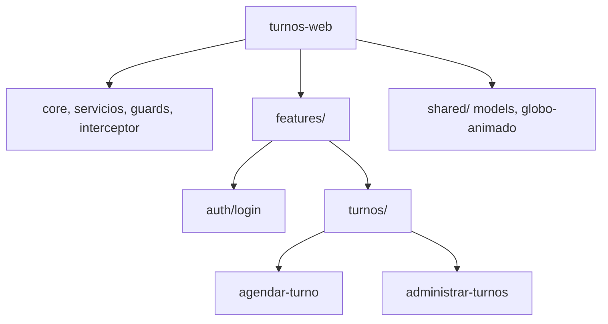

# Informe de arquitectura — Sistema de Agendamiento de Turnos

> Basado en [arc42](https://arc42.org) (plantilla oficial en español, [arc42/arc42-template](https://github.com/arc42/arc42-template)), adaptado a este proyecto. Los bloques citados como este son guía de arc42.

## 1. Introducción y metas

### 1.1 Vista de requerimientos

Sistema de agendamiento de turnos para una entidad bancaria (prueba técnica Amaris Consulting). Un cliente agenda un turno indicando su cédula y la sucursal donde será atendido, sin necesidad de estar físicamente ahí (web). Reglas de negocio centrales:

- El turno debe activarse dentro de los 15 minutos siguientes a agendarse; si no, expira automáticamente.
- Una misma cédula no puede solicitar más de 5 turnos en el mismo día, al llegar al límite queda bloqueada hasta el día siguiente.

### 1.2 Metas de calidad

Le dí especial atención a esto:

| # | Meta de calidad | Escenario concreto |
|---|---|---|
| 1 | Consistencia bajo concurrencia | Que si dos personas hacen algo al mismo tiempo sobre el mismo turno, o llegan juntas al límite de 5 turnos del día para la misma cédula, no se pisen los datos en silencio — una gana y la otra recibe un error claro|
| 2 | Experiencia de usuario / diseño | Que la app no se sintiera como un formulario cualquiera — se cuidó el diseño del front, con animaciones y buen UX/UI, no solo que funcionara |
| 3 | Rendimiento del código | Que el código no hiciera trabajo de más — se le metió una pasada de optimización tanto en el back como en el front |

Seguro quedan cosas por pulir y todavía hay mucho por aprender, pero para el alcance y el tiempo de esta prueba creo que quedó bastante bien resuelto.

### 1.3 Partes interesadas (stakeholders)

| Rol | Expectativa |
|---|---|
| Cliente (autenticado) | Agendar su propio turno con su cédula, listarlo, activarlo — sin estar en la sucursal |
| Administrador | Todo lo anterior + cancelar turnos de cualquier cliente |

## 2. Restricciones de la arquitectura

| Tipo | Restricción |
|---|---|
| Técnica | API RESTful en **.NET 8** |
| Técnica | Front-end en **Angular** — se usó Angular 21 (standalone components, sin NgModules) |
| Técnica | Persistencia en base de datos — se usó **SQL Server** vía Docker |
| Técnica | Autenticación/autorización obligatoria sobre la API |
| Organizacional | Buenas prácticas y patrones de diseño explícitamente evaluados |
| Convención | Pruebas unitarias: **xUnit + NSubstitute + Shouldly** (backend); **Vitest** en vez de Jest (frontend) — Vitest es el runner por defecto de Angular 21, compatible en API con Jest; ver nota en sección 9 |

## 3. Alcance y contexto del sistema

### 3.1 Contexto de negocio

```
Cliente (cédula, autenticado) ──agenda/activa su turno──▶ Sistema de Turnos ──atiende──▶ Sucursal
Administrador ──cancela turnos──▶ Sistema de Turnos
```

### 3.2 Contexto técnico

```
Angular SPA (:4200) ──HTTPS/JSON + JWT Bearer──▶ ASP.NET Core Web API (:5227) ──EF Core──▶ SQL Server (Docker, :1433)
```

recordar que el CORS es habilitado explícitamente para el origen del front local. Swagger disponible en desarrollo.

## 4. Estrategia de solución

| Decisión | Elección |
|---|---|
| Arquitectura backend | Clean Architecture en 4 proyectos: `Domain` → `Application` → `Infrastructure` → `Api` |
| Persistencia | Repository + Unit of Work sobre EF Core |
| Manejo de errores de negocio | Patrón `Result<TValue, TError>` (sin excepciones para flujo de negocio esperado) |
| Autenticación | JWT bearer, emitido por `POST /api/auth/login` |
| Autorización | `[Authorize]` + roles (`Administrador`, `Cliente`) vía claim de rol en el JWT |
| Frontend | Angular standalone components, lazy loading por feature |
| Concurrencia (agregado) | Transacción con aislamiento *Serializable* + reintentos, para el límite de 5 turnos/día |
| Concurrencia (fila individual) | Concurrencia optimista (`RowVersion`) en `Turno`, para evitar que dos acciones simultáneas sobre el mismo turno se pisen en silencio |

Las justificaciones de las decisiones más discutibles quedan en la sección 9 (Decisiones de diseño).

## 5. Vista de bloques de construcción

### 5.1 Backend — `Amaris.Turnos.sln`

| Proyecto | Contenido |
|---|---|
| `Amaris.Turnos.Domain` | Entidades `Turno`, `Sucursal`, `Usuario`; enums `EstadoTurno` (Pendiente/Activado/Expirado/Cancelado), `RolUsuario` (Administrador/Cliente) |
| `Amaris.Turnos.Application` | `TurnoService`, `AuthService` (reglas de negocio), `Result<TValue,TError>`, interfaces de repositorio/UoW, `TurnoOptions` |
| `Amaris.Turnos.Infrastructure` | `TurnosDbContext` (EF Core), repositorios, `UnitOfWork`, `JwtTokenGenerator`, `PasswordHasher`, `TurnoExpiracionBackgroundService` |
| `Amaris.Turnos.Api` | Controllers (`TurnosController`, `SucursalesController`, `AuthController`), DTOs, `ExceptionHandlingMiddleware`, `Program.cs` |

**Endpoints:**

| Método | Ruta | Auth | Descripción |
|---|---|---|---|
| POST | `/api/auth/login` | — | Login, devuelve JWT + rol |
| POST | `/api/turnos` | Cualquier rol | Crea turno (valida cédula, sucursal activa, límite 5/día) |
| GET | `/api/turnos` | Cualquier rol | Lista turnos (filtros: sucursalId, estado, fecha, cédula) |
| GET | `/api/turnos/{id}` | Cualquier rol | Turno por id |
| POST | `/api/turnos/{id}/activar` | Cualquier rol | Activa turno dentro de la ventana de 15 min |
| POST | `/api/turnos/{id}/cancelar` | Solo Administrador | Cancela turno pendiente |
| GET | `/api/sucursales` | Público | Lista sucursales |

### 5.2 Frontend — `frontend/turnos-web`

| Carpeta | Contenido |
|---|---|
| `core/` | `auth.service.ts`, `turnos.service.ts`, `sucursales.service.ts`, `auth.interceptor.ts` (adjunta JWT), `auth.guard.ts`/`admin.guard.ts`, `reloj.service.ts`, `turnos-lista.service.ts`, `http-error.util.ts` |
| `features/auth/login/` | Formulario de login |
| `features/turnos/agendar-turno/` | Crear turno + tabla con "Activar" (cualquier rol autenticado) |
| `features/turnos/administrar-turnos/` | Misma tabla + "Cancelar" (solo Administrador) |
| `shared/models/` | Interfaces TS que reflejan los DTOs del backend |
| `shared/globo-animado/` | Componente presentacional (animación decorativa del login) |

**Capas del backend** (la flecha indica "depende de" — las dependencias solo miran hacia adentro, `Domain` no depende de nada):



**Estructura del frontend:**



## 6. Vista de ejecución (runtime)

### Escenario: agendar turno

1. Cliente envía `POST /api/turnos` con cédula + sucursal.
2. `TurnoService.CrearTurnoAsync` valida formato de cédula y que la sucursal exista/esté activa.
3. Dentro de una transacción *Serializable*: cuenta turnos de la cédula hoy (rechaza con 409 si ≥5), calcula `NumeroTurno` (correlativo por sucursal/día), inserta el turno en `Pendiente` con `FechaHoraExpiracion = ahora + 15min`.

### Escenario: expiración automática

- **Perezosa:** si se intenta activar un turno vencido, se marca `Expirado` en ese momento.
- **Proactiva:** `TurnoExpiracionBackgroundService` corre cada N segundos (configurable) y expira en bloque los turnos `Pendiente` vencidos.

### Escenario: login y autorización

1. `POST /api/auth/login` valida credenciales (hash con `PasswordHasher<Usuario>`), emite JWT con claim de rol.
2. El frontend adjunta el token en cada request (`auth.interceptor.ts`).
3. Un 401 en cualquier request autenticado cierra la sesión y redirige a login.

## 7. Vista de despliegue

| Elemento | Detalle |
|---|---|
| Base de datos | SQL Server 2022, contenedor Docker (`docker-compose.yml`), puerto 1433 |
| Backend (dev) | `dotnet run --project backend/src/Amaris.Turnos.Api`, `http://localhost:5227`, Swagger en `/swagger` |
| Frontend (dev) | `ng serve`, `http://localhost:4200` |
| Configuración | `appsettings.json` (versionado, sin secretos) + `appsettings.Development.json` (gitignored, valores reales locales) + `.env` en la raíz para Docker |

Esta prueba corre solo local (Docker para la base de datos); no hubo un despliegue real a un ambiente externo. Los pasos para levantarlo están en el README.


## 8. Requisitos de calidad

### 8.1 Árbol de calidad

Raíz: *calidad de la solución*, ramas = los 5 criterios explícitos del PDF:

- Diseño de arquitectura
- Buenas prácticas de código
- Seguridad
- Eficiencia y escalabilidad
- Pruebas unitarias

### 8.2 Escenarios de calidad

| Escenario | Resultado esperado |
|---|---|
| Dos solicitudes simultáneas de la misma cédula, ambas en el 5º turno del día | Solo una tiene éxito, la otra recibe 409 |
| Un turno pendiente sin activar tras 15 minutos | Pasa a Expirado sin intervención manual |
| Request sin JWT válido a un endpoint protegido | 401 |
| Cliente intenta cancelar un turno | 403 (solo Administrador puede) |
| 116 pruebas automáticas (51 backend, 65 frontend) | Todas en verde |

